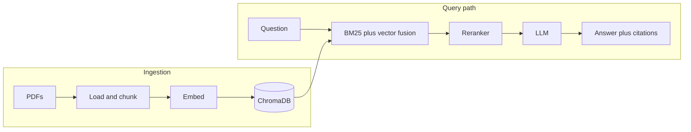

# Ask My Docs — production RAG for AI/ML research papers

End-to-end retrieval stack over a local PDF corpus: hybrid BM25 and vector search, Cohere reranking, Groq generation with Pydantic-grounded citations, Ragas metrics, CI gate, FastAPI, and Gradio.

**Live demo:** add your Hugging Face Space URL here after deploy.

## Architecture

Static diagram (optional for slides): `docs/architecture.png` (export from Excalidraw or draw.io).



## What it does

The stack ingests PDFs into ChromaDB with local sentence-transformer embeddings. At query time it runs weighted hybrid search (BM25 plus dense vectors), reranks candidates with Cohere, then asks Groq (Llama 3.1) to answer only from the provided context. Citations are built from retrieval metadata, not from free-form model text, so source lines stay tied to real chunks. Ragas scores and a CI gate track regression on a fixed question set.

## Technical highlights

- Hybrid search with weighted fusion (BM25 0.4, dense 0.6) in `rag_docs/core/retrieval.py`
- Reranking with `rerank-english-v3.0` before generation
- Pydantic models for answers and citations (`rag_docs/entity/generation_models.py`)
- Ragas evaluation and committed `evaluation_results.json`; GitHub Actions runs `check_results.py` as a quality gate
- FastAPI (`POST /ask`, `GET /health`, OpenAPI at `/docs`) plus Gradio UI that calls the API over HTTP
- Retriever, reranker, and generator built once at API startup (FastAPI lifespan)

## Evaluation results

Committed run (`evaluation_results.json`, 20 questions). Answer relevancy is skipped for this setup (Groq batch constraint).

| Metric            | Score |
| ----------------- | ----- |
| Faithfulness      | 0.73  |
| Answer relevancy  | n/a   |
| Context precision | 0.81  |
| Context recall    | 0.35  |

Quality gate: faithfulness minimum 0.7 (passing in the committed file).

## Example outputs

Excerpted from the `samples` field in `evaluation_results.json` (wording may differ slightly on a live run after retrieval noise).

**Q:** "How does the attention mechanism work in transformers?"

**A:** "According to the Transformer paper [1], the attention mechanism allows modeling dependencies without regard to distance in the input or output sequences [2, 19]…" (answer continues with encoder/decoder self-attention and Figure 3.)

**Sources:** chunk text in the eval trace maps to filenames in `data/documents/` (e.g. _Attention Is All You Need_). **Time:** generation alone is typically sub-second on Groq; end-to-end latency includes retrieval and reranking.

**Q:** "What is multi-head attention and why is it used?"

**A:** Describes attending in multiple representation subspaces, linear projections to dk/dv, and why a single averaged head is weaker.

**Q:** "How does dropout regularization prevent overfitting?"

**A:** Randomly drops units during training so no single unit dominates; ties to cited discussion of regularization in the corpus.

## Tech stack

| Component  | Technology                    |
| ---------- | ----------------------------- |
| LLM        | Llama 3.1 8B Instant via Groq |
| Embeddings | all-MiniLM-L6-v2 (local)      |
| Vector DB  | ChromaDB (local persistence)  |
| Search     | BM25 plus dense hybrid        |
| Reranking  | Cohere rerank-english-v3.0    |
| Evaluation | Ragas                         |
| API        | FastAPI, Uvicorn              |
| UI         | Gradio                        |
| CI         | GitHub Actions                |

## Project structure

```
rag-docs-assistant/
├── app/
│   ├── api.py           # FastAPI app and routes
│   ├── ui.py            # Gradio UI (HTTP client to API)
│   └── run.py           # API on :8000 and UI on :7860
├── data/
│   ├── documents/       # PDF corpus
│   └── eval_questions.json
├── rag_docs/
│   ├── config/settings.py
│   ├── entity/
│   ├── logging/logger.py
│   ├── utils/file_utils.py
│   └── core/            # ingestion, retrieval, reranking, generation, evaluation
├── tests/
│   └── conftest.py      # shared retriever fixture; skips if no outbound HTTPS
├── .github/workflows/eval.yml
├── main.py              # CLI pipeline entry
├── run_evaluation.py
├── check_results.py     # CI quality gate reader
├── evaluation_results.json
├── start.sh
├── requirements.txt
├── .env.example
└── README.md
```

## How to run

```bash
git clone <your-fork-url>
cd RAG-DOC-ASSISTANT
python -m venv venv
source venv/bin/activate   # Windows: venv\Scripts\activate
pip install -r requirements.txt
cp .env.example .env       # add GROQ_API_KEY and COHERE_API_KEY
```

Ingest and persist the vector store (run when PDFs or chunk settings change):

```bash
python main.py --ingest
```

One-off question through the pipeline (loads models each time unless you wire reuse yourself):

```bash
python main.py
```

API plus UI (from repository root):

```bash
python -m app.run
# same behavior:
python app/run.py
```

- API and Swagger: http://127.0.0.1:8000/docs
- Gradio: http://127.0.0.1:7860

API only (no Gradio): `uvicorn app.api:app --host 0.0.0.0 --port 8000`

Shell helper:

```bash
chmod +x start.sh
./start.sh
```

## Design notes (interview-style)

**Why hybrid search?** Dense retrieval misses exact keywords and rare entities; BM25 misses paraphrases. Weighted fusion keeps both failure modes in check on a small academic corpus.

**Why rerank after retrieval?** First-stage retrieval favors recall (more chunks). A cross-encoder scores query–passage fit more accurately on a short list, which stabilizes what the LLM sees.

**Why citations from artifacts?** Parsing bracketed references out of model text is brittle. Attaching citation rows from ranked chunks guarantees each label maps to a real source file and chunk index.

**Why singleton retriever/reranker/generator?** Embedding model load, BM25 index build, and API clients are expensive. Building them in the FastAPI lifespan keeps latency predictable for interactive use.

## Tests and evaluation

`tests/conftest.py` clears `HTTP(S)_PROXY` (broken proxies often break Hugging Face hub) and probes `huggingface.co:443`. If that fails, retrieval and reranking tests are **skipped** instead of erroring; generation unit tests, empty-rerank handling, and `tests/test_app.py` still run.

`test_real_groq_call` is marked `live_groq`: it runs only with outbound HTTPS and a set `GROQ_API_KEY`; otherwise it is skipped.

```bash
pytest tests/               # 52 tests with network; subset passes when offline
python run_evaluation.py    # needs keys; writes evaluation_results.json
```

Manual end-to-end smoke (rate-limited on free Cohere tier):

```bash
python tests/test_manual_pipeline.py
```

## License and data

Use and license of bundled PDFs follow their original publications; this repo is a technical demo only.
