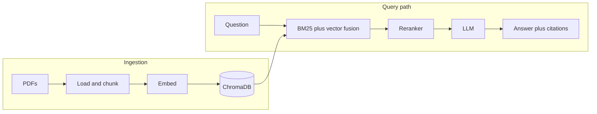

<<<<<<< HEAD
# Ask My Docs — Production RAG Application

A production-ready Retrieval Augmented Generation (RAG) system that answers questions about AI & ML research papers. Built with a hybrid search pipeline, reranking, structured citation generation, automated evaluation, and a web UI with REST API.
=======
# Ask My Docs — production RAG for AI/ML research papers

End-to-end retrieval stack over a local PDF corpus: hybrid BM25 and vector search, Cohere reranking, Groq generation with Pydantic-grounded citations, Ragas metrics, CI gate, FastAPI, and Gradio.

**Live demo:** add your Hugging Face Space URL here after deploy.

## Architecture
>>>>>>> 56f9955 (Code completed all 52 test passes)

Static diagram (optional for slides): `docs/architecture.png` (export from Excalidraw or draw.io).

<<<<<<< HEAD
## Architecture

```
User Question
      ↓
  Gradio UI (port 7860)
      ↓  HTTP POST /ask
  FastAPI Backend (port 8000)
      ↓
┌─────────────────────────────────┐
│         RAG Pipeline            │
│                                 │
│  1. Hybrid Retrieval            │
│     BM25 (0.4) + Vector (0.6)   │
│     → top 8 chunks              │
│                                 │
│  2. Reranking                   │
│     Cohere rerank-english-v3.0  │
│     → top 3 chunks              │
│                                 │
│  3. Generation                  │
│     Groq llama-3.1-8b-instant   │
│     → structured cited answer   │
└─────────────────────────────────┘
      ↓
  Answer + Citations + Metadata
```
=======


## What it does

The stack ingests PDFs into ChromaDB with local sentence-transformer embeddings. At query time it runs weighted hybrid search (BM25 plus dense vectors), reranks candidates with Cohere, then asks Groq (Llama 3.1) to answer only from the provided context. Citations are built from retrieval metadata, not from free-form model text, so source lines stay tied to real chunks. Ragas scores and a CI gate track regression on a fixed question set.

## Technical highlights

- Hybrid search with weighted fusion (BM25 0.4, dense 0.6) in `rag_docs/core/retrieval.py`
- Reranking with `rerank-english-v3.0` before generation
- Pydantic models for answers and citations (`rag_docs/entity/generation_models.py`)
- Ragas evaluation and committed `evaluation_results.json`; GitHub Actions runs `check_results.py` as a quality gate
- FastAPI (`POST /ask`, `GET /health`, OpenAPI at `/docs`) plus Gradio UI that calls the API over HTTP
- Retriever, reranker, and generator built once at API startup (FastAPI lifespan)

## Evaluation results

Committed run (`evaluation_results.json`, 20 questions). Answer relevancy is skipped for this setup (Groq batch constraint).

| Metric            | Score |
|-------------------|-------|
| Faithfulness      | 0.73  |
| Answer relevancy  | n/a   |
| Context precision | 0.81  |
| Context recall    | 0.35  |

Quality gate: faithfulness minimum 0.7 (passing in the committed file).

## Example outputs

Excerpted from the `samples` field in `evaluation_results.json` (wording may differ slightly on a live run after retrieval noise).

**Q:** "How does the attention mechanism work in transformers?"

**A:** "According to the Transformer paper [1], the attention mechanism allows modeling dependencies without regard to distance in the input or output sequences [2, 19]…" (answer continues with encoder/decoder self-attention and Figure 3.)

**Sources:** chunk text in the eval trace maps to filenames in `data/documents/` (e.g. *Attention Is All You Need*). **Time:** generation alone is typically sub-second on Groq; end-to-end latency includes retrieval and reranking.

**Q:** "What is multi-head attention and why is it used?"

**A:** Describes attending in multiple representation subspaces, linear projections to dk/dv, and why a single averaged head is weaker.

**Q:** "How does dropout regularization prevent overfitting?"

**A:** Randomly drops units during training so no single unit dominates; ties to cited discussion of regularization in the corpus.

## Tech stack

| Component   | Technology                          |
|------------|-------------------------------------|
| LLM        | Llama 3.1 8B Instant via Groq       |
| Embeddings | all-MiniLM-L6-v2 (local)            |
| Vector DB  | ChromaDB (local persistence)        |
| Search     | BM25 plus dense hybrid              |
| Reranking  | Cohere rerank-english-v3.0          |
| Evaluation | Ragas                               |
| API        | FastAPI, Uvicorn                    |
| UI         | Gradio                              |
| CI         | GitHub Actions                      |

## Project structure

```
rag-docs-assistant/
├── app/
│   ├── api.py           # FastAPI app and routes
│   ├── ui.py            # Gradio UI (HTTP client to API)
│   └── run.py           # API on :8000 and UI on :7860
├── data/
│   ├── documents/       # PDF corpus
│   └── eval_questions.json
├── rag_docs/
│   ├── config/settings.py
│   ├── entity/
│   ├── logging/logger.py
│   ├── utils/file_utils.py
│   └── core/            # ingestion, retrieval, reranking, generation, evaluation
├── tests/
│   └── conftest.py      # shared retriever fixture; skips if no outbound HTTPS
├── .github/workflows/eval.yml
├── main.py              # CLI pipeline entry
├── run_evaluation.py
├── check_results.py     # CI quality gate reader
├── evaluation_results.json
├── start.sh
├── requirements.txt
├── .env.example
└── README.md
```

## How to run

```bash
git clone <your-fork-url>
cd RAG-DOC-ASSISTANT
python -m venv venv
source venv/bin/activate   # Windows: venv\Scripts\activate
pip install -r requirements.txt
cp .env.example .env       # add GROQ_API_KEY and COHERE_API_KEY
```

Ingest and persist the vector store (run when PDFs or chunk settings change):

```bash
python main.py --ingest
```

One-off question through the pipeline (loads models each time unless you wire reuse yourself):

```bash
python main.py
```

API plus UI (from repository root):

```bash
python -m app.run
# same behavior:
python app/run.py
```

- API and Swagger: http://127.0.0.1:8000/docs  
- Gradio: http://127.0.0.1:7860  

API only (no Gradio): `uvicorn app.api:app --host 0.0.0.0 --port 8000`

Shell helper:

```bash
chmod +x start.sh
./start.sh
```

## Design notes (interview-style)
>>>>>>> 56f9955 (Code completed all 52 test passes)

**Why hybrid search?** Dense retrieval misses exact keywords and rare entities; BM25 misses paraphrases. Weighted fusion keeps both failure modes in check on a small academic corpus.

**Why rerank after retrieval?** First-stage retrieval favors recall (more chunks). A cross-encoder scores query–passage fit more accurately on a short list, which stabilizes what the LLM sees.

<<<<<<< HEAD
Evaluated on 20 questions across 28 AI/ML research papers using Ragas.

| Metric            | Score | Threshold |
|-------------------|-------|-----------|
| Faithfulness      | 0.734 | ≥ 0.70 ✅ |
| Context Precision | 0.808 | —         |
| Context Recall    | 0.350 | —         |

> Answer relevancy is skipped — Groq only supports `n=1` and Ragas requires `n>1` for this metric.

Quality gate: **PASS** — enforced automatically via GitHub Actions CI on every push.
=======
**Why citations from artifacts?** Parsing bracketed references out of model text is brittle. Attaching citation rows from ranked chunks guarantees each label maps to a real source file and chunk index.

**Why singleton retriever/reranker/generator?** Embedding model load, BM25 index build, and API clients are expensive. Building them in the FastAPI lifespan keeps latency predictable for interactive use.

## Tests and evaluation
>>>>>>> 56f9955 (Code completed all 52 test passes)

`tests/conftest.py` clears `HTTP(S)_PROXY` (broken proxies often break Hugging Face hub) and probes `huggingface.co:443`. If that fails, retrieval and reranking tests are **skipped** instead of erroring; generation unit tests, empty-rerank handling, and `tests/test_app.py` still run.

`test_real_groq_call` is marked `live_groq`: it runs only with outbound HTTPS and a set `GROQ_API_KEY`; otherwise it is skipped.

<<<<<<< HEAD
| Component     | Technology                              |
|---------------|-----------------------------------------|
| LLM           | Groq — llama-3.1-8b-instant             |
| Embeddings    | sentence-transformers/all-MiniLM-L6-v2 (local, CPU) |
| Vector DB     | ChromaDB (local)                        |
| Keyword Search| rank-bm25                               |
| Reranking     | Cohere rerank-english-v3.0              |
| Evaluation    | Ragas                                   |
| Backend API   | FastAPI + Uvicorn                       |
| Frontend UI   | Gradio                                  |
| CI            | GitHub Actions                          |

All components are free. No OpenAI.
=======
```bash
pytest tests/               # 52 tests with network; subset passes when offline
python run_evaluation.py    # needs keys; writes evaluation_results.json
```
>>>>>>> 56f9955 (Code completed all 52 test passes)

Manual end-to-end smoke (rate-limited on free Cohere tier):

<<<<<<< HEAD
## Project Structure

```
rag-docs-assistant/
├── data/
│   ├── documents/                  ← 28 PDF research papers
│   └── eval_questions.json         ← 20 evaluation questions + ground truths
├── rag_docs/
│   ├── config/settings.py          ← all constants
│   ├── entity/                     ← dataclasses + Pydantic models
│   ├── logging/logger.py           ← structured logging
│   └── core/
│       ├── ingestion.py            ← PDF loading, chunking, embedding, ChromaDB
│       ├── retrieval.py            ← hybrid BM25 + vector search
│       ├── reranking.py            ← Cohere reranker
│       ├── generation.py           ← Groq LLM + structured output
│       └── evaluation.py          ← Ragas evaluation pipeline
├── tests/                          ← 51 automated tests
├── .github/workflows/eval.yml      ← CI quality gate
├── main.py                         ← full pipeline entry point
├── run_evaluation.py               ← runs Ragas evaluation
├── check_results.py                ← reads results, exits 0 or 1 for CI
├── api.py                          ← FastAPI REST endpoint
├── app.py                          ← Gradio web UI
├── start.sh                        ← launches both servers together
└── evaluation_results.json         ← committed results read by CI
```

---

## Setup

### 1. Clone the repository

```bash
git clone https://github.com/YOUR_USERNAME/rag-docs-assistant.git
cd rag-docs-assistant
```

### 2. Create and activate virtual environment

```bash
python -m venv venv
source venv/bin/activate
```

### 3. Install dependencies

```bash
pip install -r requirements.txt
```

### 4. Set up environment variables

```bash
cp .env.example .env
```

Edit `.env` and add your API keys:

```
GROQ_API_KEY=your_groq_api_key_here
COHERE_API_KEY=your_cohere_api_key_here
```

Get your keys here — both are free:
- Groq: https://console.groq.com
- Cohere: https://dashboard.cohere.com

### 5. Add your PDF documents

Place your PDF files in `data/documents/`.

### 6. Run ingestion

This only needs to be done once. It loads all PDFs, chunks them, embeds them, and stores them in ChromaDB.

```bash
python main.py --ingest
```

---

## How to Run

### Option A — Both servers with one command

```bash
./start.sh
```

- Gradio UI → http://localhost:7860
- FastAPI → http://localhost:8000
- API docs → http://localhost:8000/docs

Press `Ctrl+C` to stop both.

### Option B — Run separately

**Terminal 1 — API:**
```bash
source venv/bin/activate
uvicorn api:app --port 8000
```

**Terminal 2 — UI:**
```bash
source venv/bin/activate
python app.py
```

### Run the full pipeline from terminal

```bash
python main.py
```

### Run evaluation

```bash
python run_evaluation.py
```

### Check evaluation results

```bash
python check_results.py
```

---

## API Usage

### Health check

```bash
curl http://localhost:8000/health
```

```json
{
  "status": "ok",
  "pipeline": {
    "retriever": true,
    "reranker": true,
    "generator": true
  }
}
```

### Ask a question

```bash
curl -X POST http://localhost:8000/ask \
  -H "Content-Type: application/json" \
  -d '{"question": "How does the attention mechanism work in transformers?"}'
```

```json
{
  "question": "How does the attention mechanism work in transformers?",
  "answer": "According to the Transformer paper, the attention mechanism...",
  "citations": [
    {
      "source": "transformer_paper.pdf",
      "chunk_index": 1,
      "relevance_score": 0.979
    },
    {
      "source": "transformer_paper.pdf",
      "chunk_index": 2,
      "relevance_score": 0.896
    },
    {
      "source": "transformer_paper.pdf",
      "chunk_index": 3,
      "relevance_score": 0.562
    }
  ],
  "model_used": "llama-3.1-8b-instant",
  "generation_time_seconds": 0.83,
  "total_chunks_used": 3
}
```

Interactive API docs available at `http://localhost:8000/docs`.

---

## Tests

```bash
pytest tests/
```

```
tests/test_pipeline.py        26 passed
tests/test_reranking.py       14 passed
tests/test_generation.py      11 passed

Total: 51 passed
```

---

## CI — GitHub Actions

Every push to `main` triggers the quality gate:

1. Checks out the repository
2. Reads `evaluation_results.json` (committed to repo)
3. Fails the build if faithfulness drops below 0.70
4. Prints scores summary

No API calls are made in CI — the pipeline runs locally and results are committed.

---

## Sample Output

```
Question : How does the attention mechanism work in transformers?

Answer   : According to the Transformer paper, the attention mechanism allows
           modeling of dependencies without regard to their distance in the
           input or output sequences...

Citations:
  [1] transformer_paper.pdf  |  chunk 1  |  score 0.979
  [2] transformer_paper.pdf  |  chunk 2  |  score 0.896
  [3] transformer_paper.pdf  |  chunk 3  |  score 0.562

Model    : llama-3.1-8b-instant
Time     : retrieval 0.091s  |  rerank 0.371s  |  generation 0.69s
```

---

## License

MIT
=======
```bash
python tests/test_manual_pipeline.py
```

## License and data

Use and license of bundled PDFs follow their original publications; this repo is a technical demo only.
>>>>>>> 56f9955 (Code completed all 52 test passes)
